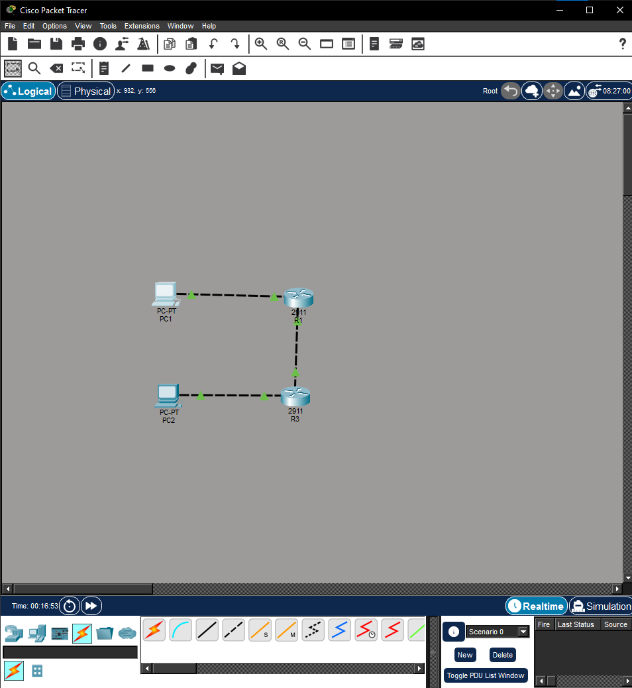
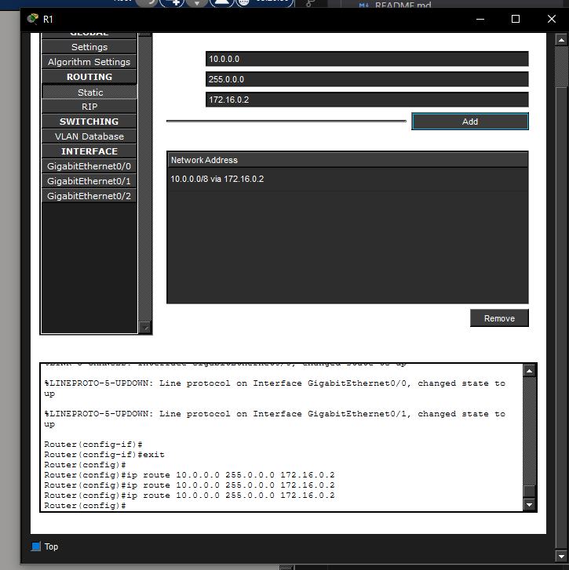
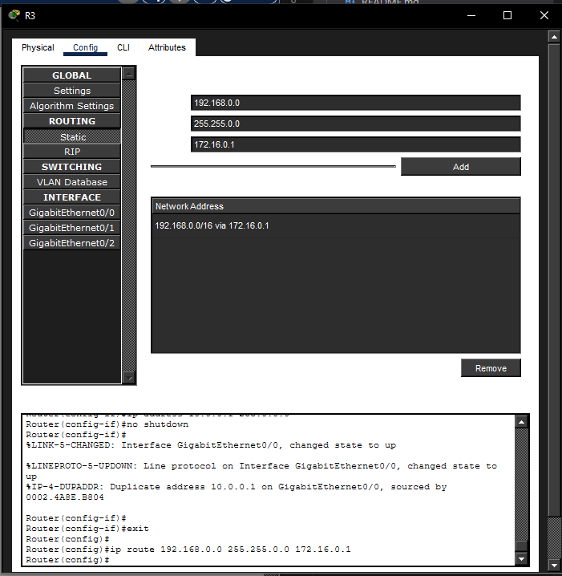
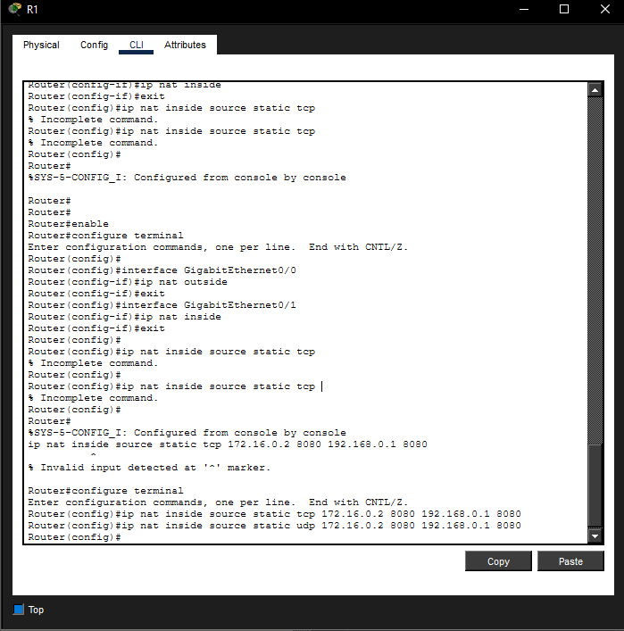
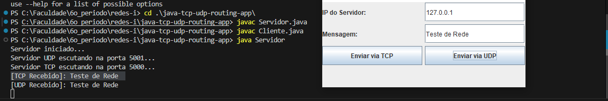
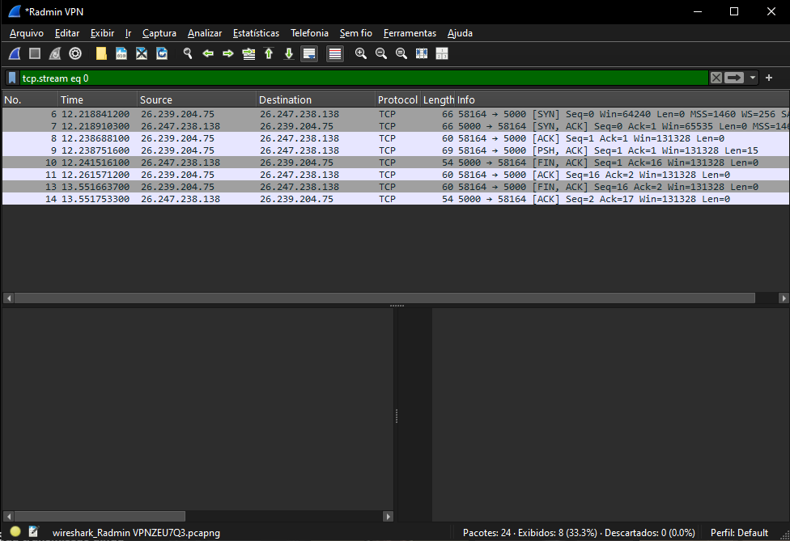
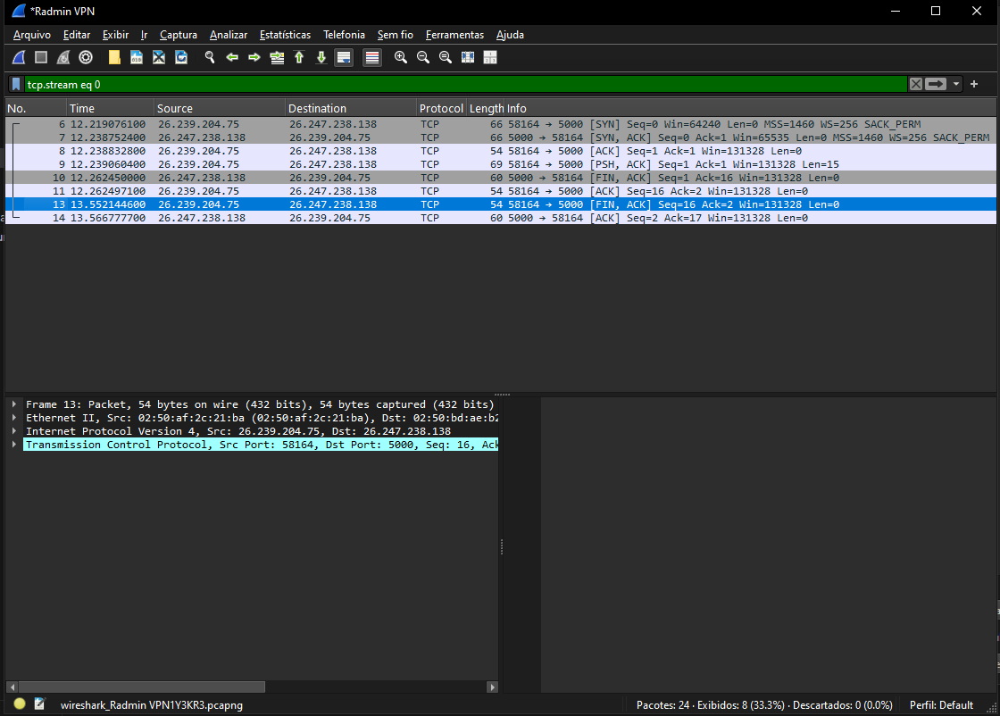
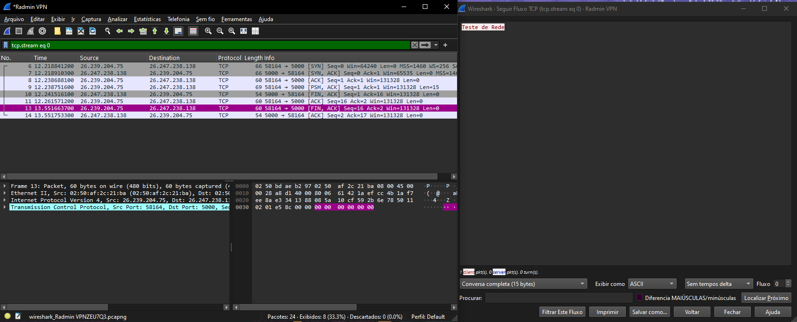
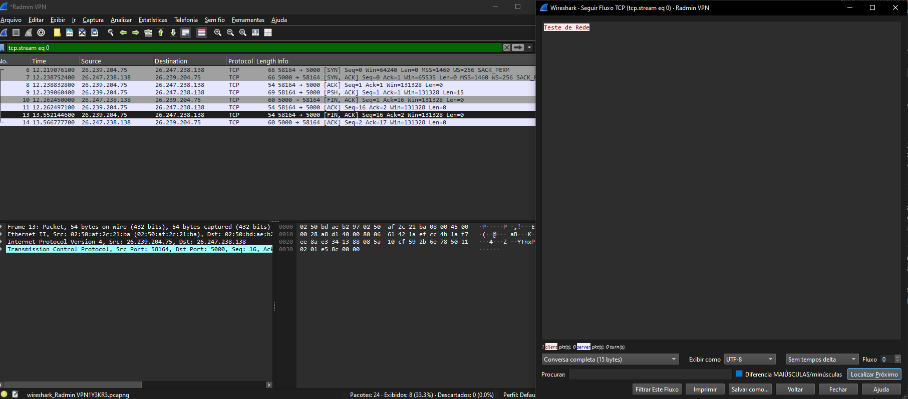

# Trabalho Prático I - Roteamento

**Nome do Aluno:** [SEU NOME AQUI]  
**Matrícula:** [SUA MATRÍCULA AQUI]  
**Disciplina:** Redes de Computadores I  
**Professor(a):** [NOME DO PROFESSOR]  
**Data:** [DATA DA ENTREGA]

---

## 1. Objetivo
O objetivo deste trabalho prático é consolidar os conceitos de infraestrutura de redes e desenvolvimento de aplicações distribuídas. O projeto engloba a configuração de uma topologia de rede utilizando o Cisco Packet Tracer, implementando roteamento estático e redirecionamento de portas (Port Forwarding), bem como o desenvolvimento de uma aplicação cliente-servidor em Java. A aplicação utiliza multithreading e os protocolos da camada de transporte TCP e UDP para demonstrar o envio e recebimento simultâneo de mensagens em uma rede simulada e, posteriormente, analisada via Wireshark.

---

## 2. Metodologia e Topologia (Fase 1)
A topologia exigida no projeto foi adaptada para utilizar dois roteadores (R1 e R3) e dois computadores (PC1 e PC2), mantendo o particionamento em três redes distintas (192.168.0.0/16, 172.16.0.0/12 e 10.0.0.0/8). 

* **Configuração Base:** O PC1 atua como cliente na rede 192.168.0.0/16 (via gateway R1). O PC2 atua como servidor na rede 10.0.0.0/8 (via gateway R3). O R1 e R3 interconectam-se através da rede 172.16.0.0/12.
* **Roteamento Estático:** Foram adicionadas rotas estáticas em R1 e R3 para permitir que pacotes originados no PC1 cheguem ao PC2 e vice-versa.
* **Port Forwarding:** Foi configurado o NAT Estático nos roteadores para redirecionar o tráfego destinado à porta da aplicação para o IP correto dentro da topologia, permitindo a comunicação fim a fim do cliente com o servidor.

---

## 3. Desenvolvimento de Software (Fase 2)
A aplicação foi construída em Java utilizando a biblioteca Swing para a interface gráfica do cliente (`Cliente.java`) e Java padrão para o Servidor (`Servidor.java`). 

Para suprir o requisito de escutar e processar requisições TCP e UDP simultaneamente na mesma máquina, o `Servidor.java` foi desenvolvido utilizando **Multithreading**. Ao ser iniciado, o programa principal ramifica duas novas *Threads*: a primeira inicializa um `ServerSocket` ouvindo na porta TCP `5000`, e a segunda inicializa um `DatagramSocket` ouvindo na porta UDP `5001`. 

No lado do cliente, botões independentes na interface gráfica capturam o IP de destino e a mensagem digitada, instanciando requisições TCP ou UDP em *Threads* separadas, garantindo que a janela do cliente não congele ("freeze") durante a espera pela resposta da rede.

---

## 4. Avaliação de Tráfego (Fase 3)
Para a validação prática, utilizou-se o software Radmin VPN para emular o roteamento entre dois computadores físicos distintos em redes remotas, criando um túnel seguro para tráfego local (LAN). Com a VPN ativa, o cliente conectou-se ao IP fornecido pela rede virtual ao PC servidor.

O tráfego de rede gerado pela aplicação Java foi inspecionado utilizando o analisador de protocolos **Wireshark**. A ferramenta foi filtrada para escutar unicamente as portas alvo da aplicação (`tcp.port == 5000 or udp.port == 5001`). 

---

## 5. Conclusão
Durante a realização deste trabalho, foi possível transpor o conhecimento teórico para um ambiente de simulação e prática. 
Os principais desafios encontrados envolveram:
1. **[Exemplo, pode editar]:** A configuração de NAT Estático e compreensão de interfaces *inside* e *outside* no terminal do Cisco Packet Tracer.
2. **[Exemplo, pode editar]:** O entendimento das configurações de rede da máquina para evitar conflitos de IP na simulação ("Duplicate Address").
3. **[Exemplo, pode editar]:** A manipulação correta das *Threads* no Java para garantir a escuta paralela dos dois protocolos.

Esses obstáculos foram solucionados através da análise minuciosa dos logs de erro do terminal (como logs do roteador e CLI) e debug da comunicação de rede através de pings segmentados, confirmando que a união de conceitos de roteamento infraestrutural e chamadas de sockets em software funcionam em uníssono para promover a comunicação de dados.
